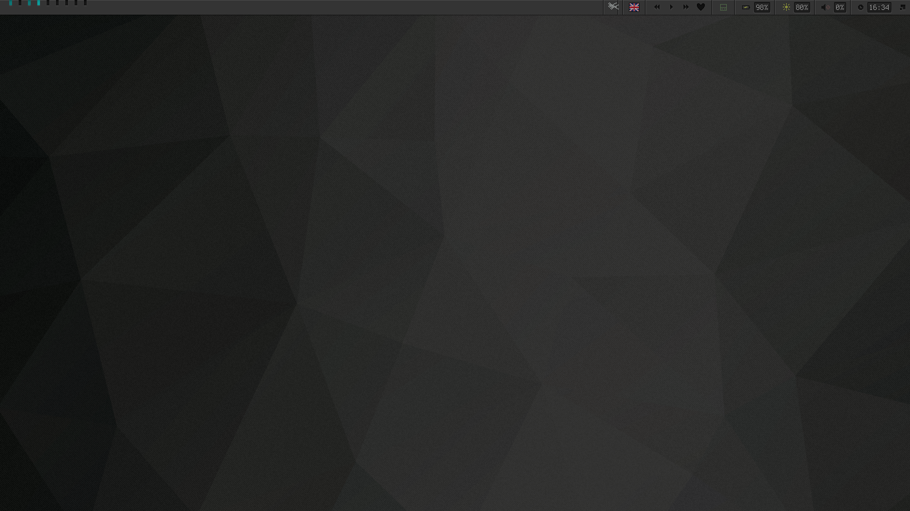
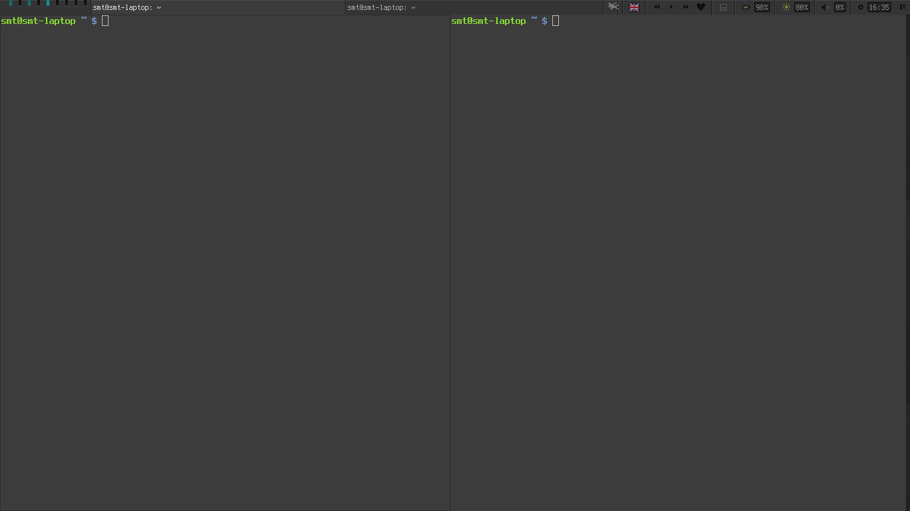

Awesome-WM Configuration
========================

There are configuration files for awesome-WM. This is fork of [pro-theme](https://github.com/barwinco/pro) with emphasis on functional part and refactorings, so it may be easier to use and modify, but with some issues in design (like, "favorites" button for MPD-widget)

Screenshots
===========

Installation
============

    cp autostart.skel.lua autostart.lua
    cp widget-list.skel.lua widget-list.lua
    cp base-config.skel.lua base-config.lua

Then you can disable widgets that you don't need in **widget-list.lua**, configure applications to run at startup in **autostart.lua** and set base configuration, like terminal to use, in **base-config.lua**.

Also note that order in widget-list is important and is used in rendering.
